

  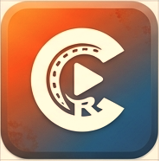

<h1 align="center">CapRust</h1>

<em>Social-first video editor in Rust. Native Windows .exe, built for short-form creators.</em>

[-purple.svg)](#what-is-caprust)

---

## Install

**Windows 10 / 11, 64-bit.** Grab the latest installer from the
[Releases page](https://github.com/Domica/CapRust/releases/latest):

1. Run `CapRust-0.9.12-win64-setup.exe`.
2. The wizard installs per-user by default (no UAC prompt). Pick
   "Install for all users" if you prefer Program Files.
3. Launch CapRust from the Start Menu.

On first run CapRust offers to download a static FFmpeg build
(~110 MB) if neither `ffmpeg` nor `ffprobe` is on your `PATH`.
AI models (Whisper, Piper, ONNX) download on demand from
**Settings → AI Models**.

---

## What is CapRust?

A modern video editor focused on **short-form social content**. Built from scratch in Rust with egui for the UI and ffmpeg for media processing.

**Not another Electron wrapper.** Native binary, starts in under 500 ms.

---

## Screenshots

  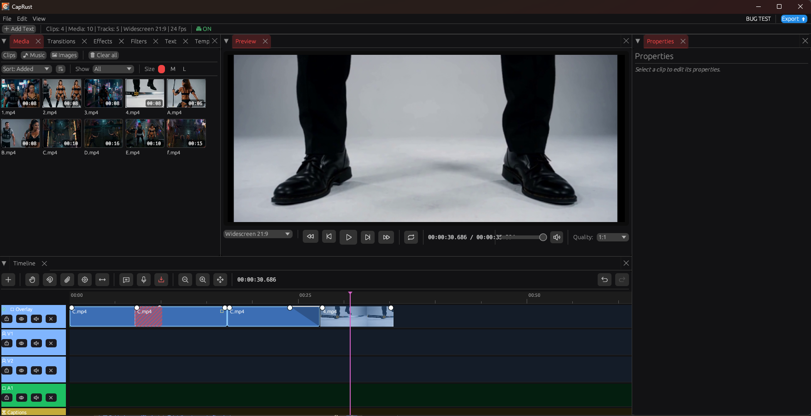
   
  <em>Editor: media bin on the left, preview in the center, timeline below, clip properties on the right.</em>

  <a href="docs/screenshots/start-screen.png">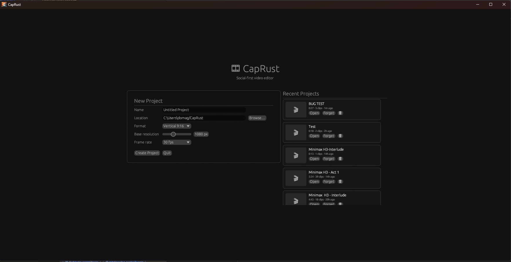</a>
  <a href="docs/screenshots/editor-tracks-caption.png">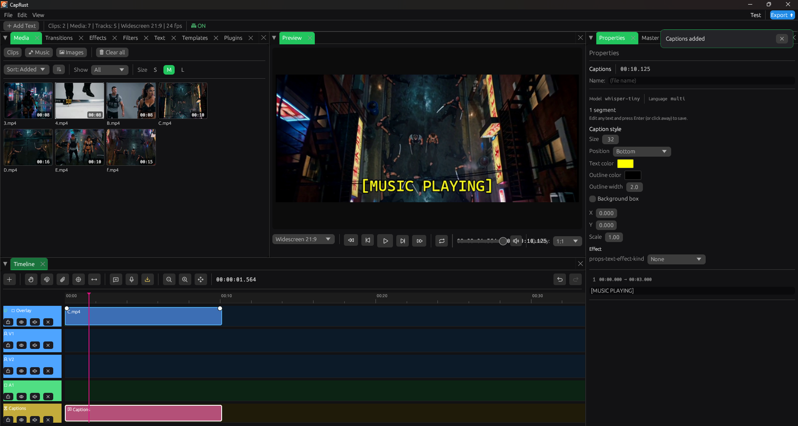</a>
  <a href="docs/screenshots/editor-clip-properties.png">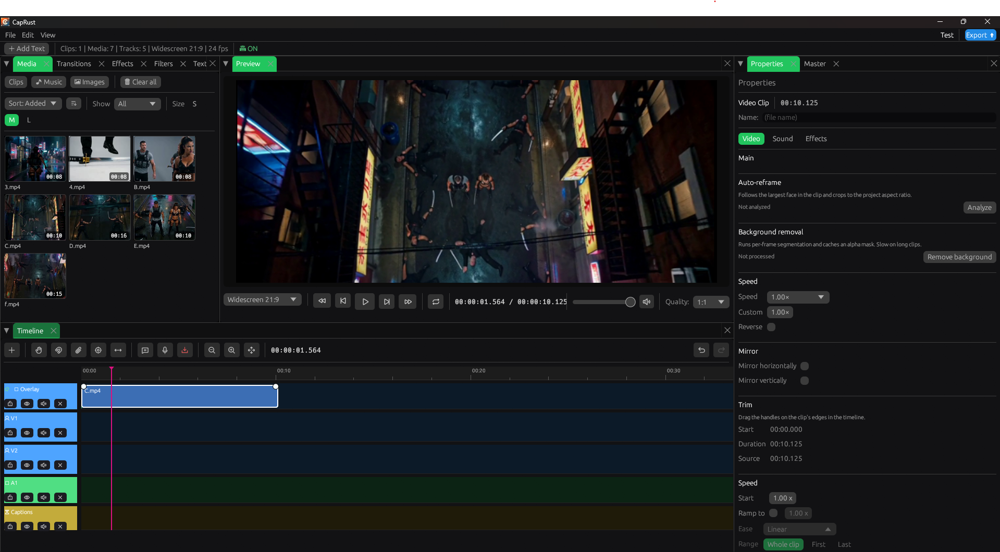</a>

  <a href="docs/screenshots/editor-effects.png">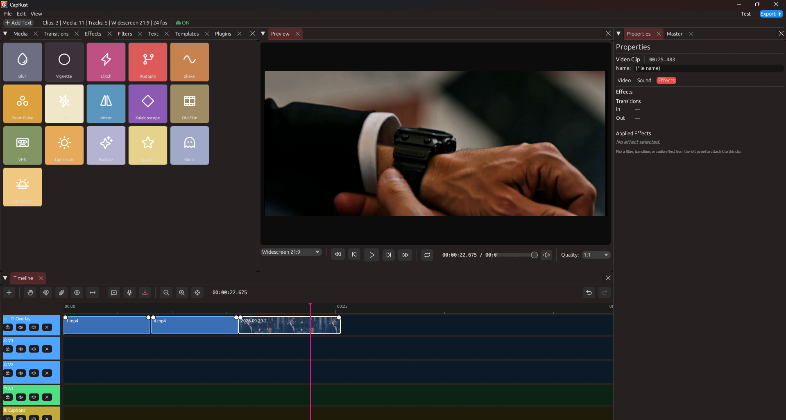</a>
  <a href="docs/screenshots/editor-transitions.png">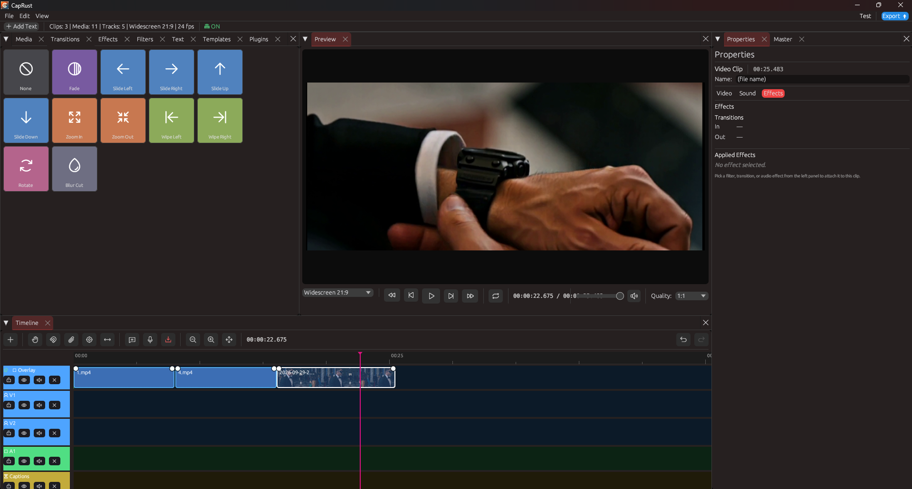</a>
  <a href="docs/screenshots/editor-master.png">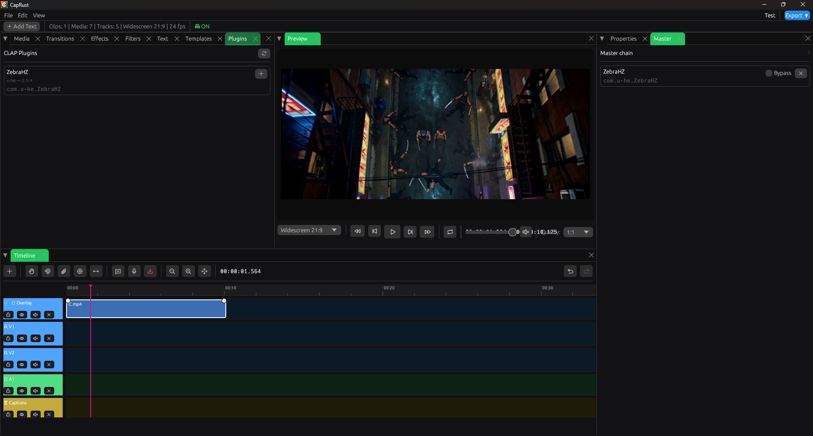</a>

  <a href="docs/screenshots/editor-settings.png">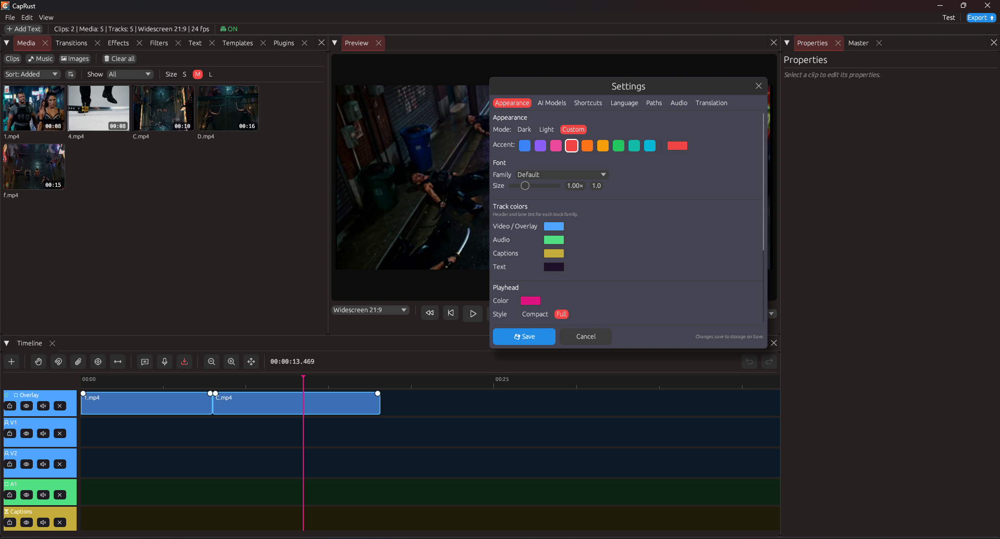</a>
  <a href="docs/screenshots/editor-settings-backup.png">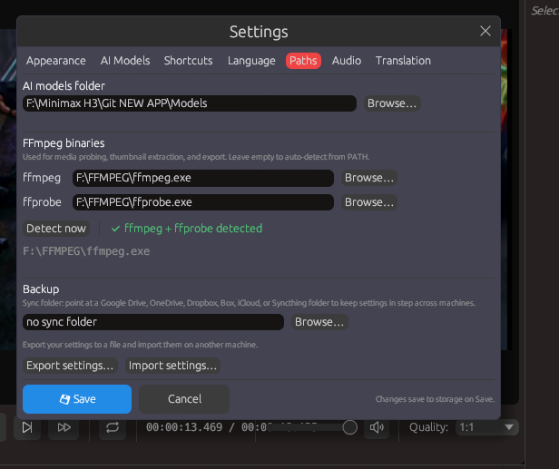</a>
  <a href="docs/screenshots/editor-filters.png">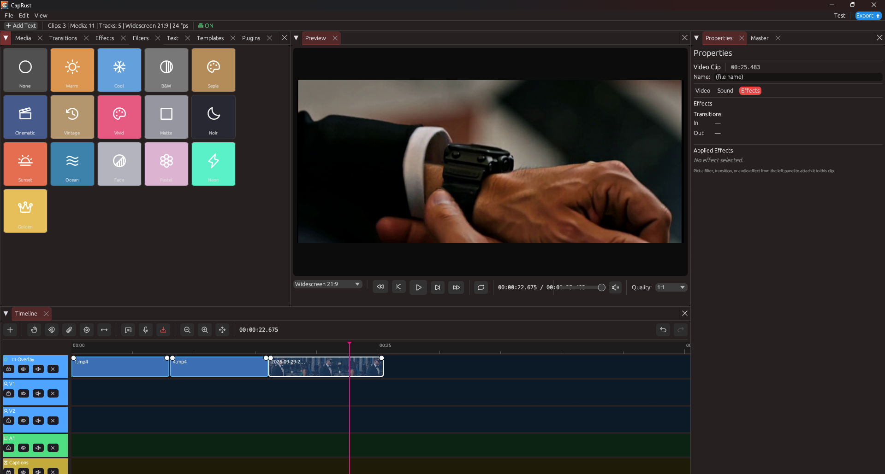</a>

### Design goals

| Goal | Status |
|---|---|
| Native performance | Yes - Rust + egui (glow backend) |
| CapCut-style UX | Yes - Dark Material theme, docked panels |
| Social format presets (9:16, 4:5, 1:1, 16:9) | Yes |
| Full undo/redo everywhere | Yes - Command pattern |
| Multi-track magnetic timeline | Yes |
| Effects + transitions | Yes - preview + export |
| Preview = Export filtergraph | Yes - same RenderPlan, no surprises |
| AI captions + narration | Yes - local Whisper + Piper |
| Progressive-reveal captions | Yes - whisper token timestamps |
| Auto-reframe (follow largest face) | Yes - SCRFD primary, YuNet fallback |
| Background removal | Yes - u2netp, per-clip mask cache |
| Speed ramps with easing | Yes - 0.1x-10x, ease + range |
| Auto-ducking | Yes - sidechaincompress |
| CLAP plugin hosting | Yes - master chain, undoable, local |
| MCP server for AI clients | Yes - 15 tools, JSON-RPC over stdio |
| Settings sync (cloud folder) | Yes - Drive, OneDrive, Dropbox, Box, iCloud, Syncthing |
| Update checker | Yes - GitHub Releases, opt-out |
| Hardware encoding | Yes (NVENC + AMF, probed at runtime) |
| Zero-config install | Yes - portable .exe |
| Chroma key (green screen) | Yes - per-clip |
| Multi-camera groups | Yes - audio sync, angle switch |
| Screen recording | Yes - DXGI, cursor overlay |

---

## Features

### Timeline
- **Magnetic mode** - clips pack end-to-end, ripple delete
- **Snap to clips** - edges and playhead
- **Multi-track** - V1/V2, A1/A2, Text, pinned Overlay, Captions
- **Drag and drop** from media library
- **Cross-track drag**, trim handles, split at playhead
- **Multi-select** - Ctrl+click, marquee rubber-band. Drag one selected clip to move the entire group in one undoable step.
- **Follow playhead** during playback, **trim-follow** option
- **Pan tool** for horizontal navigation
- **Per-track chips** - mute, hide, lock, pin (all render-affecting)

### Media
- Import **video** (MP4, MOV, AVI, MKV, WebM), **audio** (MP3, WAV, M4A, FLAC), **images** (PNG, JPG, WebP)
- Auto **thumbnails** via ffmpeg extraction + per-project cache
- **Background probe** - duration, resolution, FPS
- **Multi-select** in the bin: Ctrl+click toggles, plain click replaces. Drag a multi-selection onto the timeline to insert every item in sequence.
- **Missing-media relink** on load. Dialog lists every missing file, folder picker matches by basename, whole batch runs as one undoable `RelinkManyCommand`. Media bin shows a red badge, timeline clips without a source get a red diagonal hatch.
- **Media bin** with sort (added / name / type), filter (all / video / audio / image), preview size (S / M / L)

### Multi-camera
- **Multi-cam groups** - right-click 2+ selected clips -> Create multicam group. The group references the clips by id; no new tracks are created.
- **Angle switch** - Multicam dock panel has one button per angle. Click to change the active angle; preview and export follow immediately. One undoable step.
- **Audio sync** - `Sync angles` correlates the RMS envelopes of every angle and writes per-angle offsets through `SetMultiCamSyncCommand`. Auto-aligns multi-cam recordings from any source.

### Effects, Filters and Transitions
- **16 effect presets** - blur, vignette, glitch, RGB split, B&W, flash, mirror, kaleido, old film, VHS, light leak, particle, sparkle, ghost, lens flare, zoom pulse
- **16 color filters** - warm, cool, B&W, sepia, cinematic, vintage, vivid, matte, noir, sunset, ocean, fade, pastel, neon, gold, none
- **12 transitions** - fade, slide (L/R/U/D), wipe (L/R), zoom (in/out), rotate, blur
- **8 text styles** - default, bold, subtitle, lower, quote, caption, glow, handwrite
- **Amount-aware** - every preset scales with the per-clip amount; disabled stages are skipped
- **Per-clip effects chain** with undo/redo

### Chroma key
- **Green screen removal** - per-clip `ChromaKeySpec` with a color picker, similarity slider, and edge blend slider.
- **Preview + export** - `chromakey=color=...:similarity=...:blend=...` sits after `format=yuva420p` in Phase 1, so it composes with the existing overlay stack.
- **Enabled per clip** - Enable / Remove buttons in the Clip Properties panel under a **Chroma key** heading.

### Animations
- **Zoom pulse** - breathing crop with drifting window
- **Shake** - deterministic sin/cos camera shake, fixed 8 Hz
- **Ghost** - motion trails via tmix
- **Sparkle** - temporal noise with brightness lift
- **Particle** - softened temporal noise (atmospheric dust/snow)
- **Lens flare** - warm bloom (colorbalance + curves + gblur)

### Audio
- **Fade in/out handles** - drag on the clip's waveform
- **Volume keyframes** - piecewise-linear dB automation with eval=frame
- **Auto-ducking** - music ducks under narration via sidechaincompress
- **Speed ramps** - 0.1x-10x, with easing and range; audio uses a segmented atempo chain that matches the video setpts windows bit-for-bit
- **Preview audio** - cpal output fed by a ring buffer

### AI (all local, no cloud)
- **Whisper captions** - tiny/base/small/medium; token timestamps power the progressive-reveal render
- **Piper narration** - en_US (lessac/amy); voices download from Hugging Face
- **Auto-reframe** - YuNet face detection + keypoint pan, cached per clip
- **Background removal** - u2netp segmentation, FFV1 mask cache, maskedmerge render stage
- **DEMO marker** - zero-byte DEMO file in the models dir exercises the caption pipeline without weights

### Plugins (CLAP)
- **Scan** of the two standard CLAP folders on Windows:
  `C:\Program Files\Common Files\CLAP` and `%APPDATA%\CapRust\plugins`
- **Plugins tab** in the asset browser lists every discovered `.clap` binary with name, vendor, version, and descriptor id
- **Master chain** - one click adds a plugin to the project's master bus. New **Master dock tab** shows the active chain with per-instance Bypass and Remove
- **Real audio processing** on the PCM reader thread, between the ffmpeg decode and the cpal ring buffer. Interleaved stereo is deinterleaved, processed by each plugin in turn, reinterleaved
- **Undoable** - every add / remove / parameter edit goes through the same `UndoStack` as the rest of the app
- **Feature-gated** behind `--features clap` so Linux CI without the CLAP SDK still builds
- **Tested** against u-he ZebraHZ 2.9.4

### MCP server
- **Standalone binary** - `caprust-mcp.exe`, line-delimited JSON-RPC 2.0 on stdio
- **15 tools** - read-only inspection plus mutating operations, all going through `UndoStack`
- **Read-only:** `get_project_summary`, `list_tracks`, `list_clips`, `list_media`
- **Mutating:** `add_media`, `add_clip_to_timeline`, `move_clip`, `split_clip`, `set_transition`, `set_clip_volume`, `set_clip_speed`, `set_clip_fade`, `undo`, `redo`, `save_project`
- **No tokio, no rmcp** - 200-line hand-rolled dispatch
- **Claude Desktop** config template in `docs/mcp.md`

### Settings
- **Export / Import as JSON** - File → Settings → Paths → Backup. Versioned `SettingsFile` envelope; a newer format version is refused with a clear message, missing fields are defaulted.
- **Auto-sync via cloud folder** - point CapRust at a Google Drive, OneDrive, Dropbox, Box, iCloud Drive, Syncthing, or Nextcloud folder. On every save a snapshot is written to `<folder>/caprust-settings.json`. On startup, if the folder holds a newer snapshot, a modal offers Load them / Keep local. CapRust never talks to a cloud API; the client's folder sync is the transport.
- **User-selectable font family + size** - Settings → Appearance → Font. Families: Default (egui), Segoe UI, Arial, Consolas. Size 0.8-1.5× scales the entire UI. No font files bundled.

### Preview
- **Real-time preview** through the same filtergraph as export
- Quality selector: 1/4, 1/2, 1:1
- Frame-accurate playhead
- Wall-clock playback timing - immune to UI frame rate
- **Seek-optimized rendering** - the plan shifts every input to its `-ss`/`-t` for the current playhead. A seek into a 3-minute project renders in ~200-500 ms instead of 5-10 s.
- **Paused seek** re-renders a one-shot frame at the new playhead.
- **Auto-respawn on edit** - hash-based invalidation catches every mutation

### Screen recording
- **DXGI Desktop Duplication** - native Windows screen capture. No OBS or virtual device.
- **Cursor overlay** - COLOR and MONOCHROME pointer shapes, alpha-blended per frame.
- **Modal** - File -> Record screen. Monitor picker, duration, fps. Live REC indicator and Stop button in the editor toolbar.
- **Auto-import** - recordings land in `%APPDATA%\CapRust\recordings\` and appear in the media bin with thumbnail and waveform.

### Updates
- **Startup check** - silent GitHub Releases API request, once per 24 h, opt-out in Settings -> Appearance
- **Toast** - three actions: Download (opens release page), Remind me later (snooze 7 days), Skip this version
- **No auto-download** - the app only notifies and links

### Export
- **Multi-track compositing** - V1 / V2 / Overlay / Text / Captions z-order
- **xfade transitions** between adjacent clips
- **Effects rendering** in filtergraph
- **Caption burn-in** - drawtext with style presets
- Resolution: 4K, QHD, 1080p, 720p, 21:9, Original, 1.5x, 2x
- Frame rate: 24, 30, 60, or Original (exact fraction, preserves 29.97)
- Codec: H.264 / H.265 / AV1 on CPU (libx264 / libx265 / libsvtav1) or hardware (NVENC / AMF). The dialog probes the running ffmpeg build and only offers encoders that open on this machine.
- Quality: Small / Regular / Large (CRF 26 / 20 / 16)
- Advanced: VBR / CBR + bitrate, Color range
- Real-time progress bar, Reveal in folder

### Internationalization
- **English + Croatian** via Fluent
- Runtime language switching - no restart

### Theming
- **Dark / Light / Custom**
- 9 accent presets + color picker
- Editable track colors and playhead

---

## Quick Start

### Windows (pre-built)

Download the latest nightly build:

    gh run list --workflow=nightly.yml --limit 1
    gh run download RUN_ID -n caprust-nightly-win64
    .\caprust-app.exe

Or grab it from [Actions - Nightly Build](https://github.com/Domica/CapRust/actions/workflows/nightly.yml).

### Build from source

Prerequisites:

- Rust 1.91+ (pinned via `rust-toolchain.toml`)
- **FFmpeg 5.1+** binary in PATH (tested on 5.1.x and 7.x)
- **Windows:** Visual Studio Build Tools (C++ workload)
- **Linux:** libgtk-3-dev libxcb-shape0-dev libxkbcommon-dev libasound2-dev
- **macOS:** Xcode command line tools

    git clone https://github.com/Domica/CapRust
    cd CapRust
    cargo build --release -p caprust-app --no-default-features
    ./target/release/caprust-app

FFmpeg is called as a **subprocess**, never linked. Binary stays small, no build issues.

**CLAP plugins (optional).** CapRust scans two folders on Windows: `C:\Program Files\Common Files\CLAP` (system) and `%APPDATA%\CapRust\plugins` (user). Drop any `.clap` binary (and its `.data` folder, if the plugin has one) into either location and it appears in the Plugins tab on the next refresh. Feature is compiled in by default; Linux CI builds without the `clap` feature so the CLAP SDK is not required.

### Dev Container (Codespaces / VS Code)

    .devcontainer/
      Dockerfile
      devcontainer.json

Everything pre-installed: ffmpeg (via apt), ALSA, GTK, X11 libs, cargo-nextest.

---

## Architecture

**Cargo workspace** with strict dependency direction:

    app  ->  ui  ->  media-io  ->  core
    app  ->  ui  ->  i18n

| Crate | Purpose |
|---|---|
| **core** | Domain: timeline, commands, project state, settings, media library, models registry, cache |
| **media-io** | ffprobe, thumbnail extraction, mux, export filtergraph, preview renderer, whisper, piper, face detection, frame extraction, background removal |
| **ui** | egui app, theme, panels, timeline widgets, background jobs |
| **i18n** | Fluent bundles (en, hr) |
| **mcp** | Standalone MCP server binary (JSON-RPC over stdio) |
| **app** | Binary entry point |

### Design principles

- **Command pattern everywhere** - every mutation is undoable, testable, isolated
- **Never link libav*** - ffmpeg is always a subprocess
- **Preview = Export** - same RenderPlan, same filtergraph, no surprises
- **Wall-clock playhead** - playback timing from Instant, not UI frame count
- **Thread-local i18n** - FluentBundle is not Sync, use thread_local
- **Hash-based preview invalidation** - no per-command flags, no forgotten hooks

Full details in [DIRECTIVES.md](DIRECTIVES.md).

---

## Status

| Phase | Feature | Status |
|---|---|---|
| Core | Timeline, commands, undo/redo | Done |
| Media | Import, thumbnails, library | Done |
| Timeline | Multi-track, magnetic, snap, trim | Done |
| UI | Asset browser, properties, settings | Done |
| i18n | English + Croatian | Done |
| Preview | Real-time through export filtergraph | Done |
| Export | Video with effects + transitions + captions | Done |
| **O** | CapCut parity (fade, keyframes, ramps, ducking) | Done |
| **S** | Particle + lens flare effects | Done |
| **F1b** | Model downloader with SHA-256 | Done |
| **K** | Preview auto-respawn on edit | Done |
| **P1** | Progressive-reveal captions | Done |
| **P2** | Auto-reframe (SCRFD primary, YuNet fallback) | Done |
| **P3** | Background removal (u2netp) | Done |
| **K3** | Seek-optimized preview (per-input `-ss`/`-t`) | Done |
| **K4** | Pre-rendered audio PCM cache | Done |
| **R2** | Missing-media relink on load | Done |
| **T1** | Transition easing (model + UI) | Done |
| **T2** | Configurable transition duration | Done |
| **T3** | Xfade shifts followers + overlap shading | Done |
| **U1** | Batch undo (`MacroCommand`) + Ctrl+Z / Ctrl+Y | Done |
| **U2** | Media bin multi-select + long-press batch drag | Done |
| **I** | CLAP audio plugins | Done |
| **N** | MCP server - AI-driven editing | Done |
| **K2** | Seamless double-buffer preview | Planned |
| **Q** | Multi-cam + screen record | Done |
| **Chroma** | Chroma key (green screen) | Done |

See DIRECTIVES.md section 18 for the full roadmap.

---

## Testing

Uses **cargo-nextest** for parallel test execution:

    cargo nextest run --workspace
    cargo nextest run --workspace -E "test(ripple)"
    cargo nextest run --workspace --retries 2

CI runs on Ubuntu, Windows, macOS with clippy -D warnings.

Some integration tests are #[ignore]d because they need a real model on disk. Run them manually with:

    CAPRUST_YUNET_PATH=/path/to/yunet.onnx cargo nextest run --run-ignored face_detect
    CAPRUST_U2NETP_PATH=/path/to/u2netp.onnx cargo nextest run --run-ignored background_removal

---

## Contributing

**Open source, MIT licensed.**

Before opening a PR:

1. Read DIRECTIVES.md - the project design rules
2. Run locally:

       cargo fmt --all
       cargo clippy --workspace --all-targets -- -D warnings
       cargo nextest run --workspace

3. Reference existing issues or open a new one to discuss design

---

## Why another video editor?

CapCut is closed-source and phones home. Premiere is a subscription. DaVinci is heavy. Most open source alternatives are abandoned, Electron-based, or built on 20-year-old C++.

CapRust is:

- **Small** - portable binary
- **Fast** - native Rust, no Node runtime
- **Social-first** - 9:16, quick export, TikTok / Reels presets
- **Local AI** - Whisper, Piper, YuNet, u2netp run on your machine
- **Open** - MIT, no telemetry
- **Modern** - Rust 2021, egui, fluent, tract-onnx

---

## Version History

See [CHANGELOG.md](CHANGELOG.md) for full per-release notes.

| Version | Date | Highlights |
|---|---|---|
| **0.9.12** | 2026-10-09 | Save Frame EINVAL fix (video-only filtergraph), media-bin tab layout persistence, 27 new transitions, 10 new effects (incl. beauty skin smoothing), color LUT pipeline (.cube upload + 4 film LUTs), 5 effect/filter repairs, beat snap-to-grid + auto-cut. |
| **0.9.11** | 2026-10-08 | Three-color waveform, media bin sidebar with TabLayout (NoFilter/Filtered), 8 new text styles, View menu Tab Layout toggle, waveform color pickers, save frame path fix, disk-full hardening, vertical asset tabs. |
| **0.9.10** | 2026-10-07 | Save paused preview frame, capture folders in settings, preset categories + new presets, per-clip vidstab, About tab, vertical asset tabs, disk-full hardening. |
| **0.9.9** | 2026-10-07 | Import without duplicates, Clear-all confirm, menu highlight + shortcuts + Ctrl+S/O, transition overlap fix. |
| **0.9.8** | 2026-10-07 | SRT sidecar export; beat-sync analysis + ruler markers; 4 effects, 7 transitions, 4 voice FX; Edit menu wired; caption overlap fix; CONTRIBUTING + TRANSLATING. |
| **0.9.7** | 2026-10-06 | Export Open-folder reveal fixed (paths with spaces, missing dirs); timeline pan, scroll, resizable rows and width fixes; export finish actions use button widgets + i18n. |
| **0.9.6** | 2026-10-06 | Disabled states for chip, switch and segmented_control; error toasts for save, load, export, undo and redo; button widgets replace raw buttons in every panel. |
| **0.9.5** | 2026-10-06 | Panel polish (P3-all): switch / segmented_control / chip replace raw checkbox and selectable_value across Settings, media bin, clip properties, model prompt, and multicam. Clip.reversed now renders in video and audio chains (was silently dropped in the filtergraph). Reverse toggle capped at 60 s. |
| **0.9.4** | 2026-10-06 | Widget library (chip, switch, badge, segmented_control, tooltip_rich). Design tokens sweep. Mirror H/V now renders (was silently dropped in the filtergraph). Single-clip ducking sidechain order fixed. |
| **0.9.3** | 2026-10-06 | Timeline overlay follow-ups: polyline vertex on every volume keyframe, zoom/scroll anchoring for the envelope overlay, duck zones gated to match the export sidechain. |
| **0.9.2** | 2026-10-05 | Timeline audio envelope overlay: volume automation polyline (dB-domain interp) and duck zones with reduction-scaled opacity. Probe backfill for auto-created media on project load. |
| **0.9.1** | 2026-10-05 | Nine bug fixes (split offset, volume keyframes, orphan media relink, subprocess focus, update checker, more). Ducking reduction slider, file-based logs. |
| 0.9.0 | 2026-10-05 | Chroma key, multi-camera groups with audio sync, screen recording with cursor overlay. Video-without-audio export fix. |
| 0.8.4 | 2026-10-03 | Settings import/sync keep local ffmpeg paths, MyMemory disclosure, MCP trust model. Closes the security audit. |
| 0.8.3 | 2026-10-03 | Security hardening: CLAP path trust, SHA-256 pinning for Piper and models, ffmpeg checksum verification, protocol whitelist on media inputs. |
| 0.8.2 | 2026-10-02 | Audio tail playback past video EOF, playhead no longer freezes at video end, waveform scroll at 4x+ zoom, BG removal usable in debug builds. |
| 0.8.1 | 2026-10-02 | CBR bitrate honored on Advanced export, JobRunner path refresh, thumbnail regeneration after cache clear, bg-removal mask path validation. |
| 0.8.0 | 2026-10-02 | Trim/transition/theme fixes, waveform display, reattach audio, ripple move, per-track audio processing. |
| 0.7.0-beta.1 | 2026-10-01 | **First beta.** Windows installer, crash handler, UI polish pass (design tokens, widget library, start-screen redesign). |
| 0.6.0-alpha.1 | 2026-09-30 | Settings export/import + cloud-folder sync, user-selectable font, captions motion + effects parity. |
| 0.5.0-alpha.1 | 2026-09-29 | CLAP plugin hosting, master plugin chain, MCP server, xfade preview drift fix. |
| 0.4.0-alpha.2 | 2026-09-29 | Transition easing + duration, xfade shifts followers, timeline overlap shading, MacroCommand. |
| 0.4.0-alpha.1 | 2026-09-28 | Media bin multi-select, long-press batch drag, group move on timeline. |
| 0.3.0-alpha.1 | 2026-09-28 | Hardware-accelerated export (NVENC / AMF), seek-optimized preview, audio PCM cache. |
| 0.2.0-alpha.1 | 2026-09-29 | Dockable panel layout, captions translation (MyMemory). |
| 0.1.0-alpha.1 | 2026-09-27 | First public alpha. |

---

## License

MIT - see [LICENSE](LICENSE).

---

## Credits

Icons: Phosphor Icons
ONNX inference: tract (pure-Rust)
Face detection model: YuNet (opencv_zoo, Apache 2.0)
Background removal model: u2netp (rembg, Apache 2.0)
CLAP hosting: clack-host (MIT/Apache-2.0), tested against u-he ZebraHZ

---

Made with Rust.
